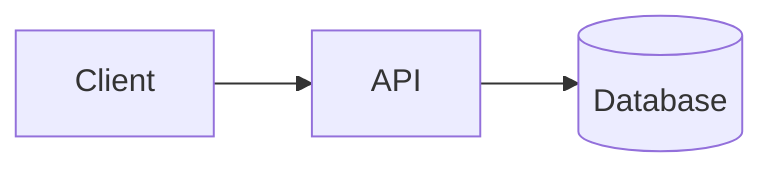
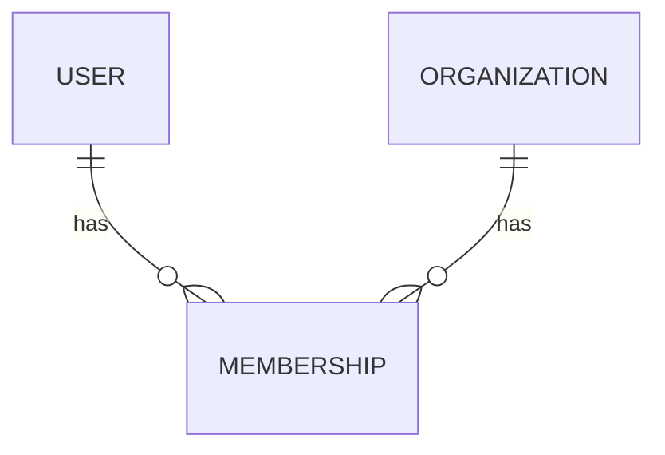
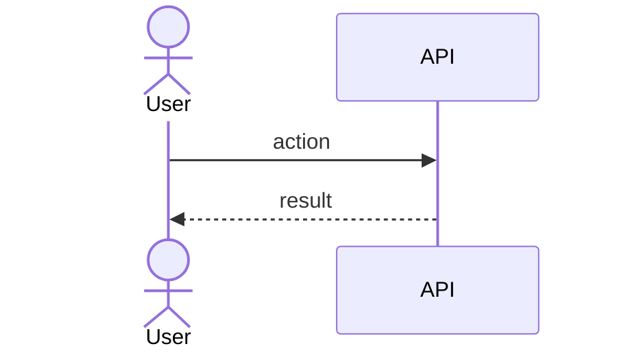

# docs-keeper

You create and maintain a consistent set of project documents under a `docs/` folder,
derived from the **actual codebase** — never from assumptions. This skill works the same
in Claude Code and in Claude Desktop; only the file-writing mechanism differs (see
"Environment notes").

## Golden rules

1. **Read before you write.** Explore the project until you understand what you are
   documenting. Documentation that contradicts the code is worse than none.
2. **Don't invent facts.** If something is genuinely unknown, write `_TBD_` plus a short
   note on what's needed. Never fabricate APIs, entities, colors, or flows.
3. **Cite real files** as relative markdown links, with a line number when it helps:
   `[tenant.ts](packages/db/src/tenant.ts:12)`.
4. **Keep it skimmable.** Short sections, tables over prose where it fits, one idea per
   heading. These docs are read by humans in a hurry and by future AI sessions.
5. **All diagrams are Mermaid** in fenced `mermaid` blocks (renders on GitHub and in most
   viewers; degrades to readable text elsewhere).

## Step 1 — Locate or create the docs directory

Find where docs live. Check, in order:

- `docs/` (preferred default)
- `doc/` — some projects use the singular; **reuse it, do not create a parallel `docs/`**
- Any existing folder of project docs the user points you at

**Reuse an existing docs tree rather than duplicating it.** Only create `docs/` if no
documentation directory exists. State which directory you chose at the start.

Throughout, `docs/` means "the documentation directory you located or created."

## Step 2 — The document set

You maintain exactly these documents (plus one per major feature). File names are fixed so
links stay stable.

| File | Purpose |
|---|---|
| `docs/index.md` | Short project description + link table to every other doc |
| `docs/architecture.md` | Components/layers, responsibilities, data flow + Mermaid diagram |
| `docs/domain-model.md` | Key entities, invariants, relationships + Mermaid ER diagram |
| `docs/brandbook.md` | Brand voice, colors, typography, tokens, core components |
| `docs/legal.md` | Legal/compliance posture — GDPR primary, extensible to other frameworks |
| `docs/owasp.md` | Security posture mapped to the OWASP Top 10 — code-derived, not a live findings log |
| `docs/features/<kebab-name>.md` | One per major feature |

### What "major feature" means
A coherent capability a user or operator cares about (e.g. "time tracking", "billing",
"offline sync", "auth & tenancy"). Prefer the project's own vocabulary. When asked to
document "all" features, identify candidates from routers, top-level modules, route
groups, package boundaries, and existing docs — then write one doc each.

## Step 3 — Templates

Use these as the shape of each doc. Adapt headings to the project; drop sections that
don't apply rather than padding them.

### `docs/index.md`
```markdown
# <Project Name>

<2–4 sentence description: what it does and for whom.>

## Documentation

| Doc | What's inside |
|---|---|
| [Architecture](architecture.md) | How the parts fit together |
| [Domain model](domain-model.md) | Entities, relationships, invariants |
| [Brandbook & design system](brandbook.md) | Brand, colors, typography, components |
| [Legal & compliance](legal.md) | GDPR and other regulatory posture |
| [Security posture (OWASP)](owasp.md) | Code-derived mapping to the OWASP Top 10 |

### Features
| Feature | Doc |
|---|---|
| <Feature> | [<feature>](features/<feature>.md) |

> Maintained by the docs-keeper skill. After adding or renaming a doc, re-sync this index.
```

### `docs/architecture.md`
````markdown
# Architecture

## Overview
<One paragraph: the shape of the system — apps, packages, services.>

## Components
| Component | Responsibility | Key files |
|---|---|---|
| <name> | <what it does> | [path](path) |

## How the parts connect


## Data flow
<Trace one or two important paths through the system, step by step.>

## Cross-cutting concerns
<Auth, multi-tenancy, error handling, background jobs — whatever applies.>
````

### `docs/domain-model.md`
````markdown
# Domain model

## Entities
| Entity | Description | Key fields |
|---|---|---|
| <Entity> | <what it represents> | <fields> |

## Relationships


## Invariants
- <Rule that must always hold, and where it's enforced.>
````

### `docs/brandbook.md`
```markdown
# Brandbook & design system

## Brand voice
<Tone, personality, do/don't.>

## Color palette
| Token | Hex | Usage |
|---|---|---|
| Primary | #RRGGBB | <where> |

## Typography
| Role | Font | Size / weight |
|---|---|---|
| Heading | <font> | <size> |

## Spacing & tokens
<Scale, radii, shadows — pull real values from the design tokens / theme if they exist.>

## Components
<Core UI building blocks and their intended use.>
```

### `docs/legal.md`
```markdown
# Legal & compliance

> This document supports compliance work derived from the codebase; it is not legal advice.
> Have counsel review before relying on it.

## GDPR

### Personal data inventory
| Data category | Field(s) | Where stored | Source |
|---|---|---|---|

### Legal basis for processing
| Purpose | Data used | Legal basis (Art. 6) |
|---|---|---|

### Data subject rights
<How access / erasure / portability / rectification requests are fulfilled today, or _TBD_.>

### Retention
| Data | Retention period | Deletion mechanism |
|---|---|---|

### Third-party processors / sub-processors
| Vendor | Purpose | Data shared | DPA in place? |
|---|---|---|---|

### Cookies & tracking
<Categories, purpose, consent mechanism — pull from actual cookie/consent code if present.>

### Cross-border transfers
<Mechanism, e.g. SCCs, if applicable, or _TBD_.>

## Other frameworks
<Add a subsection per additional framework the project needs (CCPA, HIPAA, etc.), following
the same shape: what data, what obligation, what's implemented, what's _TBD_.>
```

### `docs/owasp.md`
```markdown
# Security posture (OWASP Top 10)

> Snapshot derived from the codebase. Not a substitute for a real security audit or pentest.

## A01: Broken Access Control
| Area | Control in place | File(s) | Notes / gaps |
|---|---|---|---|

## A02: Cryptographic Failures
| Area | Control in place | File(s) | Notes / gaps |
|---|---|---|---|

## A03: Injection
| Area | Control in place | File(s) | Notes / gaps |
|---|---|---|---|

## A04: Insecure Design
| Area | Control in place | File(s) | Notes / gaps |
|---|---|---|---|

## A05: Security Misconfiguration
| Area | Control in place | File(s) | Notes / gaps |
|---|---|---|---|

## A06: Vulnerable and Outdated Components
| Area | Control in place | File(s) | Notes / gaps |
|---|---|---|---|

## A07: Identification and Authentication Failures
| Area | Control in place | File(s) | Notes / gaps |
|---|---|---|---|

## A08: Software and Data Integrity Failures
| Area | Control in place | File(s) | Notes / gaps |
|---|---|---|---|

## A09: Security Logging and Monitoring Failures
| Area | Control in place | File(s) | Notes / gaps |
|---|---|---|---|

## A10: Server-Side Request Forgery (SSRF)
| Area | Control in place | File(s) | Notes / gaps |
|---|---|---|---|

## Open items
- <Gap identified while documenting, not yet fixed — cite the file/area.>
```

### `docs/features/<feature>.md`
````markdown
# Feature: <Name>

## Purpose
<Why this exists, who uses it.>

## User flow
<Step-by-step from the user's point of view.>

## Key modules & files
| Piece | File |
|---|---|
| <thing> | [path](path) |

## Data touched
<Entities/tables read or written.>

## Edge cases & rules
<Validation, permissions, failure modes.>

## Diagram

````

## Step 4 — Keep things in sync

- Editing an existing doc **updates it in place**; don't rewrite wholesale unless the
  structure is broken.
- After creating, renaming, or deleting any doc, **update the link tables in `index.md`**
  so navigation never goes stale.
- Pull real values where they exist: design tokens for the brandbook, the ORM
  schema/migrations for the domain model, routers/route files for features, data-handling
  code (DB schema, cookie/consent logic, third-party SDKs) for `legal.md`, and
  auth/input-validation/config code for `owasp.md`.

## Step 5 — Report back

When done, give a short summary: which directory you used, which files you created vs.
updated, and any `_TBD_` sections that need the user's input.

## Environment notes

- **Claude Code / IDE:** write files directly into the docs directory with the file tools.
  The bundled `/docs` command is a convenient trigger (`/docs init`, `/docs feature <name>`,
  `/docs architecture|domain|brand|legal|owasp`, `/docs sync`).
- **Claude Desktop:** if a filesystem connector or Project with file access is available,
  write the docs there. Otherwise, produce each document's full Markdown content in the
  conversation, clearly labeled by file path, so the user can save it into `docs/`.
